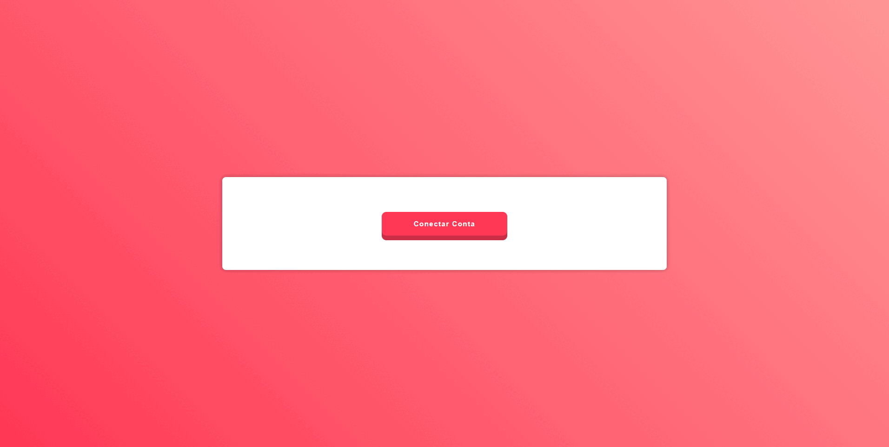

## Apresentação Geral

**Nome do Projeto:** GPhotos

**Descrição:**

O GPhotos é um projeto que utiliza a API do Google Photos para se conectar à conta do Google de um usuário e baixar todas as fotos e vídeos disponíveis. 
A aplicação oferece uma interface visual, onde o usuário pode autenticar sua conta e conceder permissões necessárias para iniciar o processo de download 
e organização dos arquivos diretamente em seu dispositivo local.



**Objetivo:**

Implementar uma aplicação que baixe automaticamente todas as fotos e vídeos de uma conta do Google Fotos após a autenticação e permissão do usuário.

**Tecnologias Utilizadas:**


## Para Desenvolvedores

Se você é um desenvolvedor interessado em contribuir ou entender melhor o funcionamento do projeto, aqui estão algumas informações adicionais:

**Ambiente:**


**Instruções de Instalação e Configuração:**

> Atenção: Obrigatório o uso de Docker em sua máquina.

1. Clone o repositório do projeto:
```
git clone https://github.com/edssaac/gphotos
```

2. Navegue até o diretório do projeto:
```
cd gphotos
```

3. Inicie a aplicação atráves do script que configura o Docker:
```
.ci_cd/init.sh  
```
Com isso a aplicação estará acessivel: [http://localhost:8080](http://localhost:8080)

> **Como Configurar:**

1. Acesse a [documentação do Google Photos](https://developers.google.com/photos/overview/configure-your-app) para criar e configurar seu próprio aplicativo.
2. Gere suas credenciais e insira-as no arquivo `credentials.json` com a estrutura abaixo:
   
   ```json
    {
        "installed": {
            "client_id": "123456789012-abcdefg12345hijklmn67890opqrstuv.apps.googleusercontent.com",
            "project_id": "example-project-123456",
            "auth_uri": "https://accounts.google.com/o/oauth2/auth",
            "token_uri": "https://oauth2.googleapis.com/token",
            "auth_provider_x509_cert_url": "https://www.googleapis.com/oauth2/v1/certs",
            "client_secret": "ABCDEF-1234567890abcdefgHIJKLMNOPQRST",
            "redirect_uris": [
                "http://localhost"
            ]
        }
    }
   ```

   Após configurar o arquivo, a ferramenta estará pronta para uso.

---

4. Quando desejar encerrar a aplicação, use:
```
.ci_cd/stop.sh
```
Caso deseje encerrar e remover os volumes criados, use:
```
.ci_cd/stop.sh -v
```

## Contato

[](https://github.com/edssaac)
[](mailto:edssaac@gmail.com)
[](mailto:edssaac@outlook.com)
[](https://www.linkedin.com/in/edssaac)
